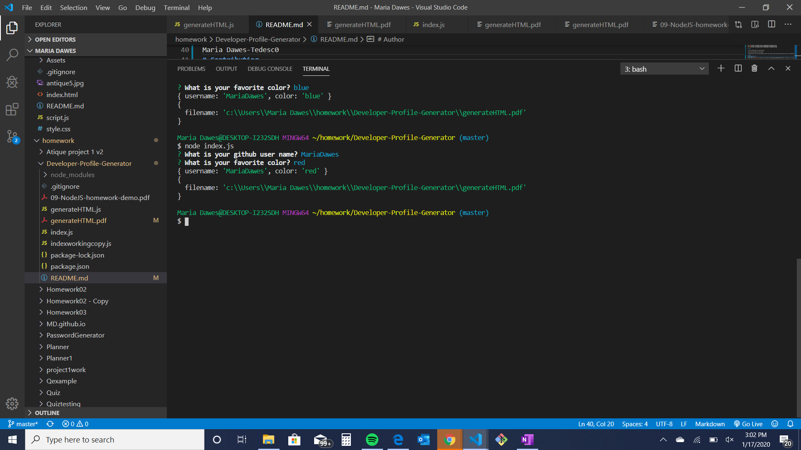

# UpdatedPortfoliopage
Create a command-line application that dynamically generates a PDF profile from a GitHub username.  
The user will be prompted for a favorite color, which will be used as the background color for cards.The PDF will be populated with the following: Profile image, User name, User bio, Number of public repositories, Number of followers, Number of GitHub stars, Number of users following, Links for User location via Google Maps, User GitHub profile and user blog

# Motivation

Have awebsite that you can see all Github profiles in a cool format. 

Learn about getting data from a website using axios.

# Prerequisites
The software will run in any Laptop, iPad and phone.

# Results 

* A pdf file was generated when ran the program. I coppied the result for each of the colors in a separate files. These files are on my Github Developer profile generator repo. 
    
    - MariaDawes - red
    - MariaDawes - blue
    - MariaDawes - pink
    - MariaDawes - green

* GIF

- Recorded file is located at my Github Developer profile generator repo under the name: developer-profile-generator-recording.avi

* Prompt and results Screenshots

# Tests 

* Colors working per color input prompt.

* Data being reveived from the website 

* Working links: Tests were performed on each of the links to make sure they would take the user to the desired website.    

# Author
Maria Dawes-Tedesc0
# Contributing
Please read [CONTRIBUTING.md](https://gist.github.com/PurpleBooth/b24679402957c63ec426) for details on our code of conduct, and the process for submitting pull requests to us.

# Versioning
For the versions available, see https://github.com/MariaDawes/Updatedportfoliopages/commits/master

# Acknowledgement
Thank you to Brittany, Kevin and Bhavana for help with explanations.
